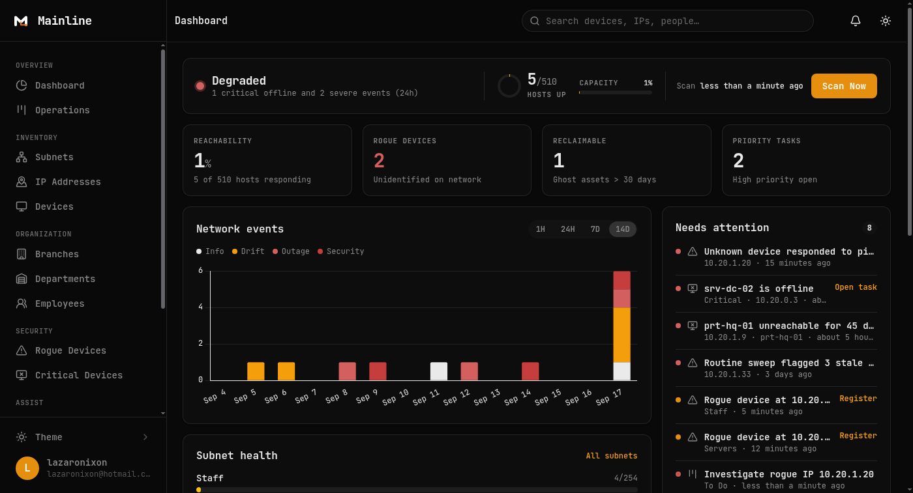
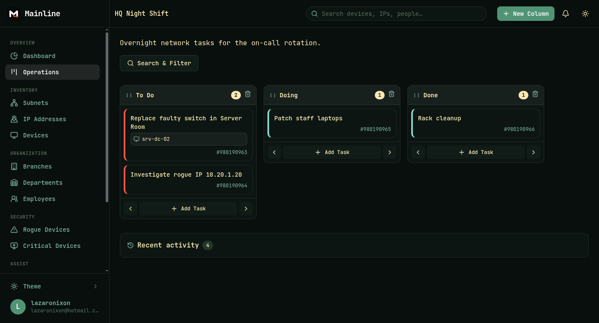
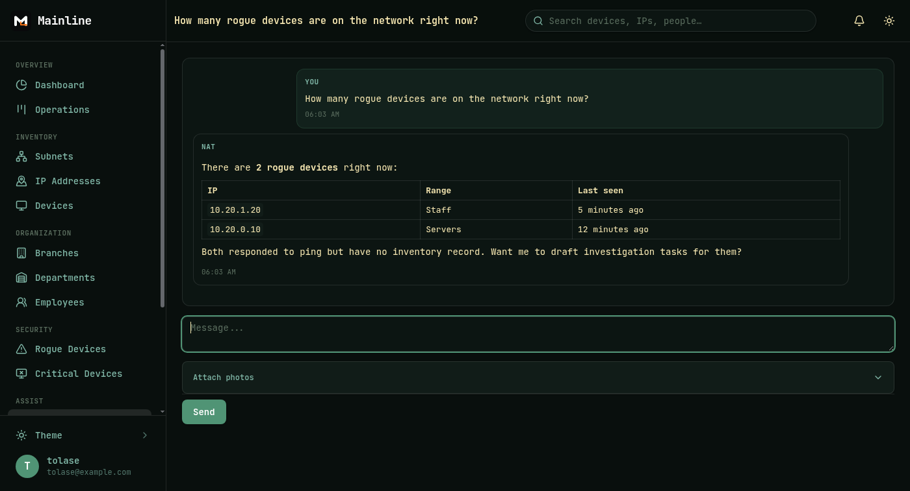
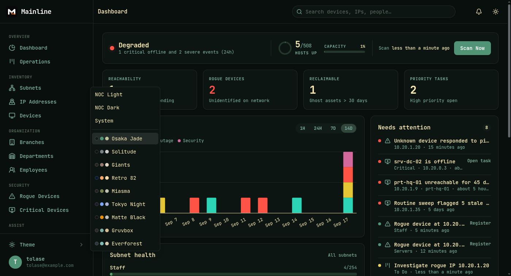

# Mainline — network inventory and operations center. Know every device on your network.


Mainline (IPAM) replaces spreadsheet IP tracking with a live source of truth: subnets, IPs, devices, and people, watched by automated ARP sweeps and assisted by NAT, an AI operator that can answer questions and make careful changes. It runs in production on a real multi-subnet network.



## Features

- **NOC dashboard** — hero status (Operational/Degraded), reachability and capacity KPIs, rogue/ghost counters, 14-day event trend with 1H/24H/7D/14D ranges, subnet health bars, ranked Needs-Attention queue, critical watchlist, live network log. Everything updates over websockets as scans complete.
- **Automated scanning** — recurring sweeps discover hosts, track reachability, and raise typed events: rogue sightings, drift, MAC takeover, ghost candidates. Manual **Scan Now** anytime.
- **Inventory hierarchy** — branches → departments → employees, devices with types/statuses/MAC discipline, subnets with auto-populated pools, gateway reservation, and overlap protection.
- **IP lifecycle** — available / active / reserved / blacklisted administration kept consistent automatically, observed separately as unknown / up / down. One-click reclaim and register flows.
- **Operations kanban** — boards with drag-and-drop, priorities, assignments, device/IP links, activity timelines; severe findings auto-file triage cards with flap-protected admin alerts.
- **NAT assistant** — chat with an AI agent over live inventory (20 tools: lookups, free-IP hunts, provisioning, bulk creates). Destructive acts always confirm first; attachments include photos, CSV/Excel, and PDFs.
- **Search everywhere** — command palette with shortcuts, global full-text search, per-page filters, saved Rogue/Critical shortcuts.
- **Audit & notifications** — PaperTrail history globally and per record, in-app realtime notifications, session/account security (challenges, verification, revocation).
- **Operator experience** — 9 dark themes, light/dark/system modes, responsive mobile layout with bottom nav, and built-in user docs at `/docs`.







## Tech stack

| Layer | Choice |
|---|---|
| Framework | Rails 8.1 (Ruby 4.0.7), Hotwire (Turbo + Stimulus), Importmap |
| Database | PostgreSQL 18 (primary, incl. `INET`/CIDR queries + full-text search), SQLite (SolidQueue / Cache / Cable) |
| Jobs & realtime | SolidQueue (recurring scans, pruning), SolidCable Turbo Streams, Mission Control dashboard |
| Scanning | `nmap` ARP sweeps (passwordless sudo) |
| AI | RubyLLM agent with function tools |
| Charts / CSS | Chart.js, Tailwind CSS v4 |
| Deploy | Kamal (single container), Thruster |
| Tests | Minitest: unit + system (Selenium/Chrome), RuboCop, Brakeman |

## Quickstart

Prerequisites: Ruby 4.0.7 (`mise` picks it up from `.ruby-version`), PostgreSQL 18 running, Node-free (importmap, no build step). For scanning: `nmap` plus passwordless sudo.

```bash
# 1. Install gems (no app boot needed)
bundle install

# 2. First boot needs credentials (fresh clones have no master.key,
#    and db tasks below crash without it):
EDITOR="code --wait" bin/rails credentials:edit
# add at minimum:
#   secret_key_base: <output of `bin/rails secret`>

# 3. Prepare databases and seed
bin/setup

# 4. Create the first admin (no public sign-up by design)
bin/rails runner 'User.create!(username: "admin", email: "admin@example.com",
  password: "Setup-Str0ng-Pass-1!", verified: true, admin: true)'
# ^ choose your own strong, unique password

# 5. Optional demo dataset
SEED_DEMO=1 bin/rails db:seed

# 6. Run it (web + jobs + worker)
bin/dev   # http://localhost:3000
```

NAT chats also need `gemini_api_key` in credentials; without it the app boots but the assistant can't answer.

### Tests & lint

```bash
bin/rails test          # unit + integration
bin/rails test:system   # browser tests (needs Chrome)
bin/rubocop             # lint (Rails Omakase)
bin/brakeman            # security scan
```

## Architecture

```
                    ┌─────────────┐
                    │   Browser   │  Turbo Drive/Frames/Streams, Stimulus
                    └──────┬──────┘
                           │ :3000
              ┌────────────▼────────────┐
              │  Puma + Rails 8.1       │──► PostgreSQL (inventory, audit, events)
              │  bin/dev: web/css/jobs/ │──► SQLite (SolidQueue/Cache/Cable)
              │  worker (SolidQueue)    │
              └─┬───────────┬───────────┘
                │ sudo      │ ActionCable   Gemini API
                ▼ nmap      ▼ (live UI)     ▲ (NAT tools)
         LAN subnets (ARP)              ░
```

Scans fan out per subnet (`NetworkScanJob` → `SubnetScanJob`s), reconcile reachability, emit typed events, auto-triage severe ones, and broadcast dashboard updates. See [Network Scanning](docs/scanning.md) in the in-app docs.

## Roadmap

- Read-only REST API (subnets, IPs, devices) for integrations
- Distributed pollers beyond a single scanner host
- Uptime/latency history alongside presence data

## Author

Built by [Tolase Adegbite](https://github.com/tolaseadegbite) — full-stack Rails. Issues and PRs welcome at [tolaseadegbite/IPAM](https://github.com/tolaseadegbite/IPAM).

## License

Not yet licensed — all rights reserved until a `LICENSE` file lands.
